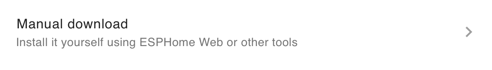
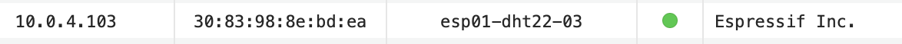
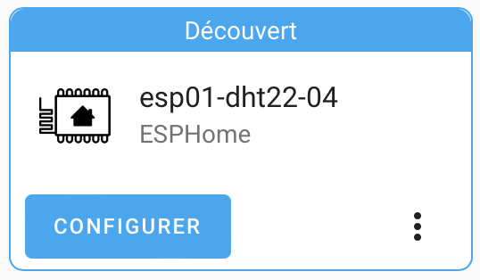
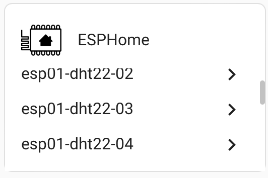
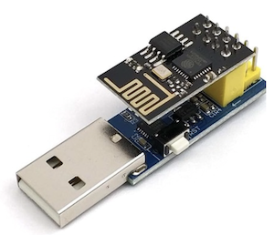
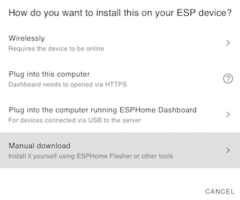
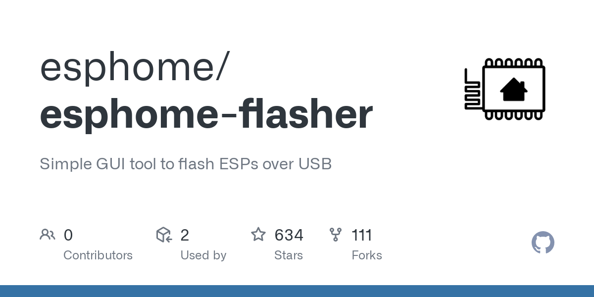

# ESP-01S ( work! )
{ width="200" }

## Steps
(more details below)

- **Add** a new ESP device - **esp8266**

{ width="300" }
{ width="300" }

- copy the **code** (see below)
- **install** - "Manual download"

{ width="500" }

- plug the esp01 on "**USB to ESP-01 Adapter** Board" (see below)
- flash the esp01 with **ESPHome-flasher**
- plug the **esp01 on the DHT22 board**
- use **LanScan** to find the new devise

{ width="600" }

- go to your router and configure a **static IP** for this new device

{ width="600" }

- unplug / plug the device to **update** the new IP
- go to integration of Homeassistant and **configure** the new integration

{ width="400" }

{ width="200" }
{ width="200" }

## esphome code

```
name: esp32-dht22-02

esp8266:
  board: esp01_1m

# Enable logging
logger:

# Enable Home Assistant API
api:

ota:
  password: "864868a05abffdf5f9bb073518cd0809"

wifi:
  ssid: !secret wifi_ssid
  password: !secret wifi_password

  # Enable fallback hotspot (captive portal) in case wifi connection fails
  ap:
    ssid: "Esp32-Dht22-02 Fallback Hotspot"
    password: "WXjJplTlkNPa"

captive_portal:
sensor:
    - platform: dht
    # model: DHT22 Don't work
    model: AM2302
    pin: GPIO02
    temperature:
        name: "esp01-dht22-04 Temperature"
        filters:
            - offset: 0.0
    humidity:
        name: "esp01-dht22-04 Humidite"
        filters:
            - offset: 0.0
    update_interval: 600s
```

## Flash ESP
USB to ESP-01 Adapter Board

{ width="200" }

### Home assistant

To be sure to correctly flash ESP make a .bin file. Use "Manual download"

{ width="300" }

## ESPHome-Flasher

Use "ESPHome-Flasher" to flash the ESP

{ width="200" }