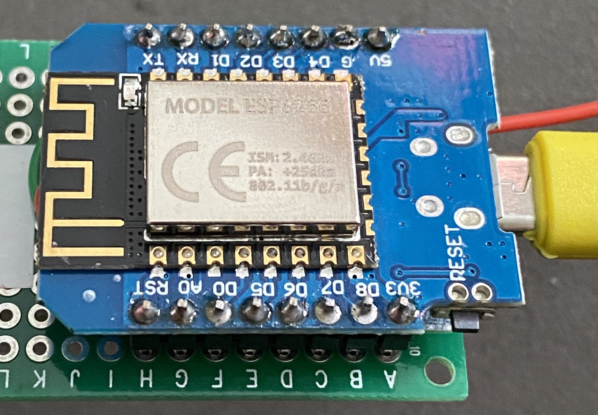

# ESP8266 DI mini

## Config with ESPHome

{ width="300" }

```
esphome:
  name: esp8266-d1-mini-2
  platform: ESP8266
  board: d1_mini

# Enable logging
logger:

# Enable Home Assistant API
api:

ota:
  password: "1f8e281487c5ab216b892b87e4767d0d"

wifi:
  ssid: !secret wifi_ssid
  password: !secret wifi_password

  # Enable fallback hotspot (captive portal) in case wifi connection fails
  ap:
    ssid: "Esp8266-D1-Mini-2"
    password: "3MvC9mMH12eY"

captive_portal:

# JM 28/12/2021
sensor:
  - platform: dht
    model: DHT22
    pin: 4 # D2
    temperature:
      name: "esp8266-d1-mini-2 Température"
      filters:
        #offset: 0.1
    humidity:
      name: "esp8266-d1-mini-2  Humidité"
    update_interval: 600s
```