# DHT22 accuracy

!!! tip
    If there is only one thing to remember from this page, it is that you have to raise the DHT22 so that the ESP does not heat up.

    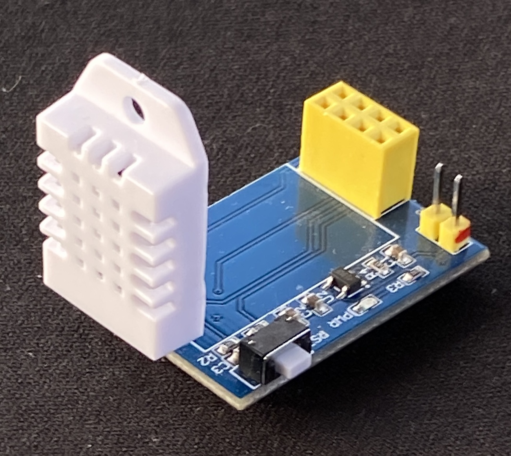{ width="200" }


To see the accuracy of my DHT22, I compared 5 of them. I coupled them all with ESP01s
as you can see below.

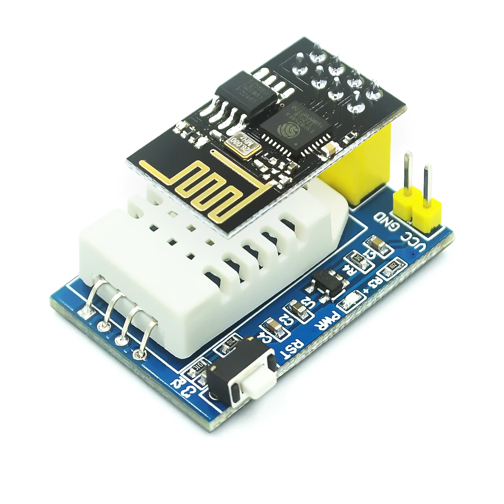{ width="150" }

I noticed a great variation of measurement between my 5 DHT22 sensors.
On the figure below, we can see that two sensors give the same temperature
and the three others very clearly different temperatures.
We notice a variation of 10.3°C between some sensors.

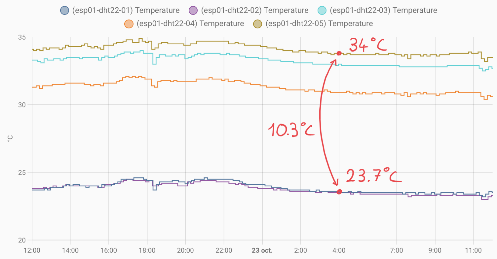{ width="600" }

Looking closely at my esp01s, I realized that I had two different models,
or rather two different manufacturers. On three of the ESPs you can clearly
read the text "esp01" and not on the 2 others as you can see below.

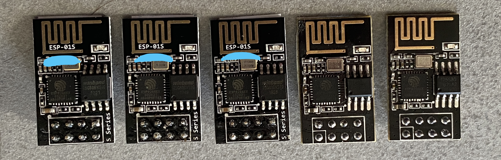{ width="600" }

This difference of manufacturer can explain the distribution of the temperatures,
2 sensors with the same value (23.7°C), and the three others with much higher temperatures.

But this does not explain why I have a variation of more than 10°C between my sensors.
I thought, it might be due to the ESP and maybe depending on the manufacturer,
they were heating more or less.

Eureka, I found. By measuring the temperature of the ESP we can see that it
heats up in a non-negligible way, more than 33°.

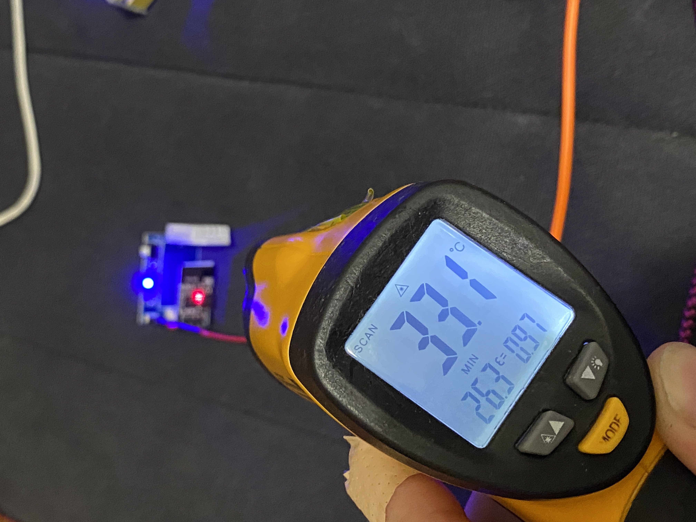{ width="200" }

To avoid that the ESP heats
the DHT 22, I twisted the temperature sensor.

{ width="200" }

Now the plastic of the DHT22 has the same temperature as the fabric next to it.

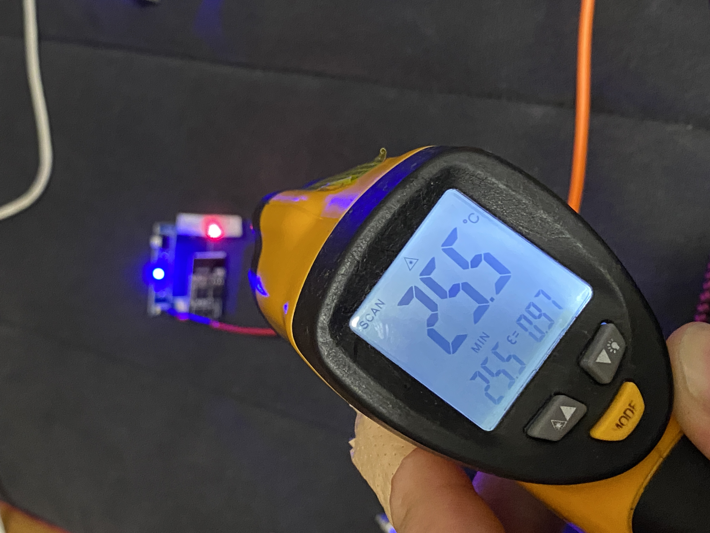{ width="200" }
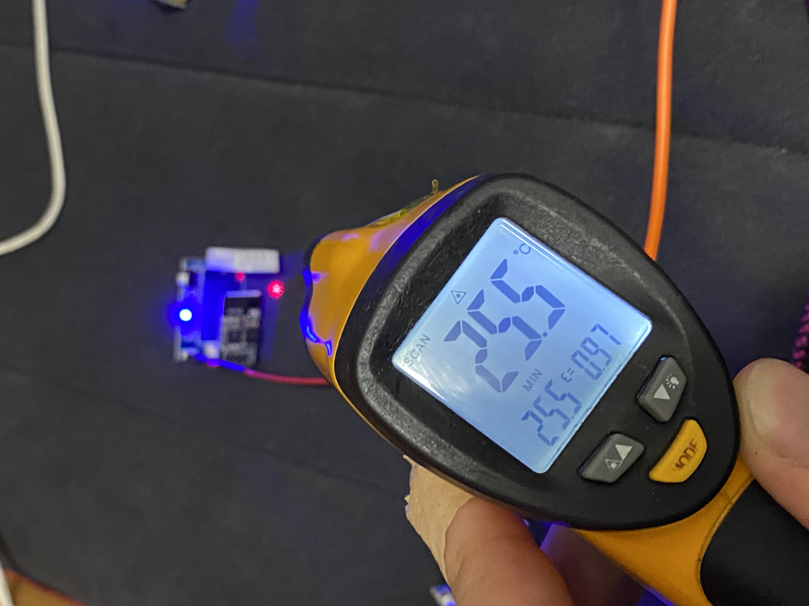{ width="200" }

Now, the five sensors give very close values as you can see below.

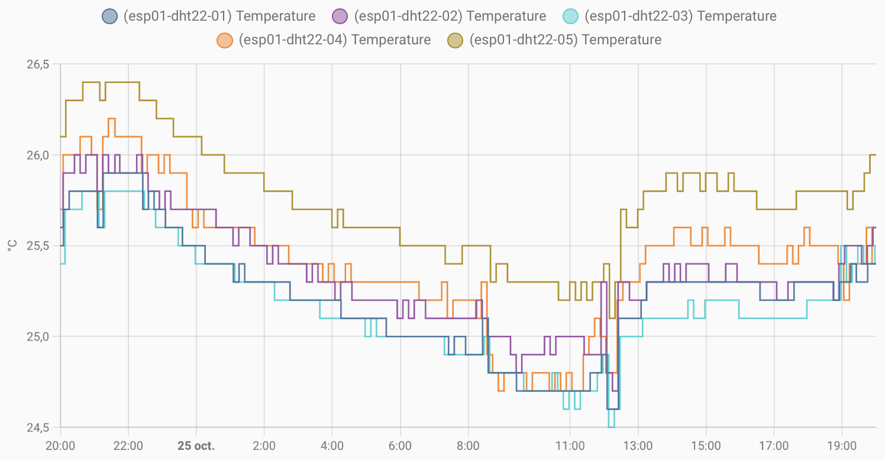{ width="600" }

The last thing to do is to calibrate all the sensors. For that, I
played on the Offset parameter in the configuration file of the ESPHome.

||esp01 #1|esp01 #2|esp01 #3|esp01 #4|esp01 #5|
|------|------|------|------|------|------|
|Temperature|-1.9|-1.8|-1.7|-1.6|-1.7|
|Humidity|-3|+6|0|0|0|

``` hl_lines="8 12"
sensor:
    - platform: dht
        model: DHT22_TYPE2
        pin: GPIO02
        temperature:
            name: "esp01-dht22-01 Temperature"
            filters:
                - offset: -1.9
        humidity:
            name: "esp01-dht22-01 Humidite"
            filters:
                - offset: -3
        update_interval: 600s
```
I have now five calibrated DHT22 sensors

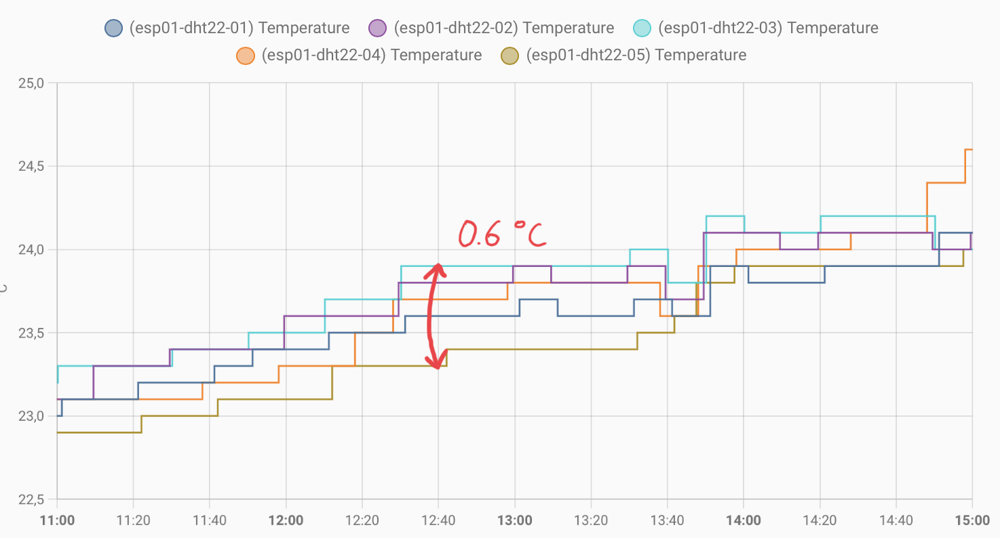{ width="500" }


## esp32
The accuracy of the ESP32 processor is not great, there can be an error of more than 3°C.

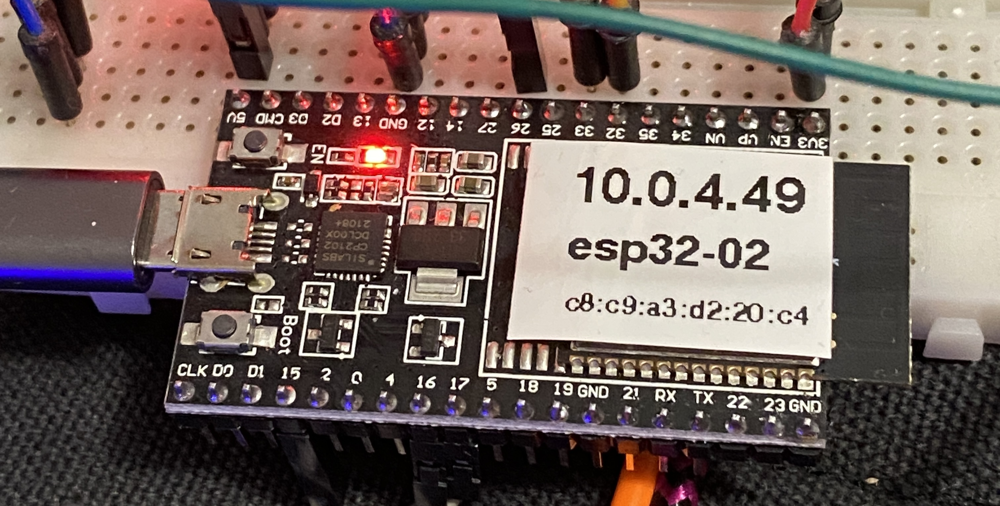{ width="300" }

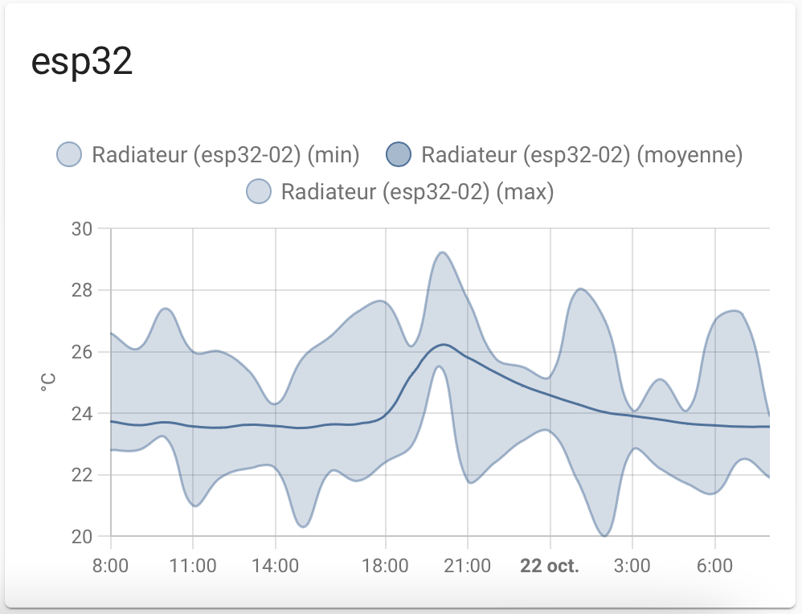{ width="500" }

## esp8266
ESP32 varies very little, around 0.3°C

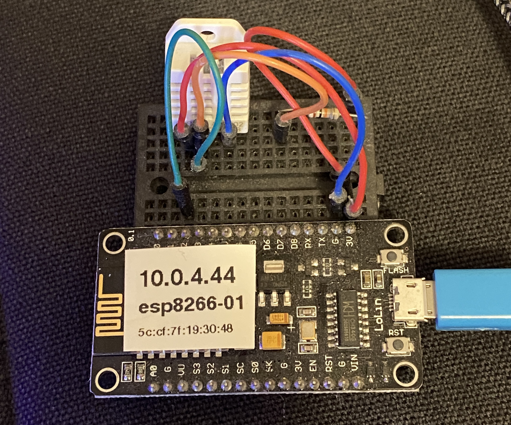{ width="300" }

{ width="500" }

## esp8266-d1-mini
ESP266-d1-mini varies very little, around 0.3°C

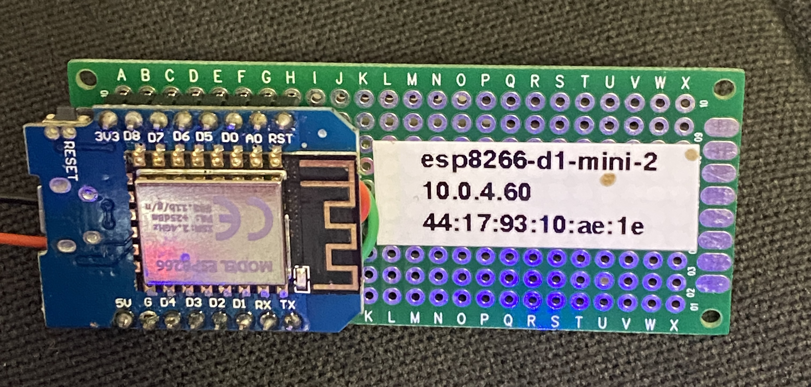{ width="300" }

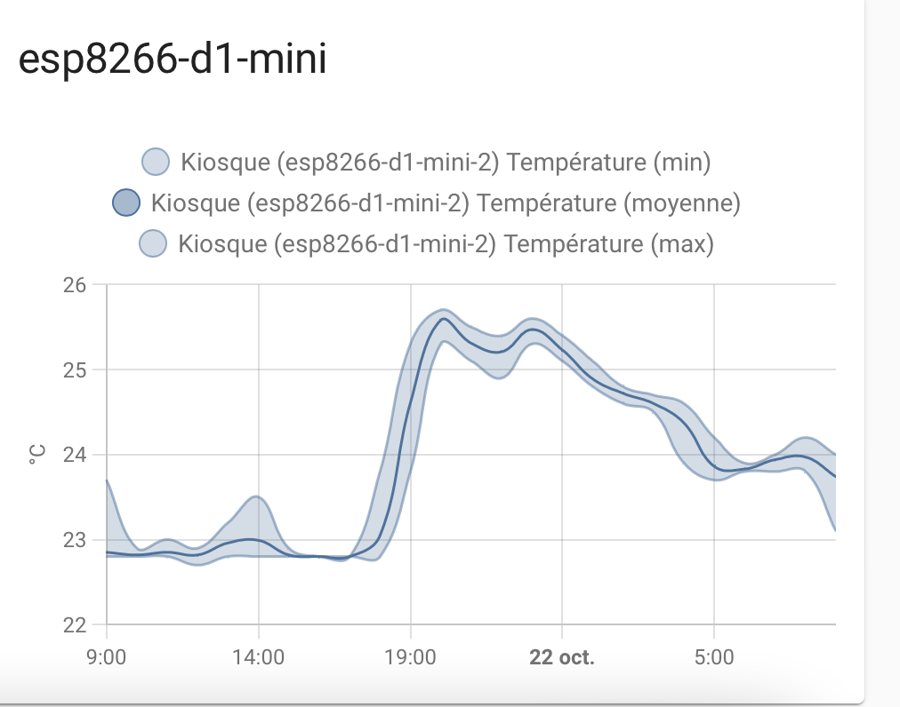{ width="500" }

