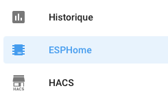
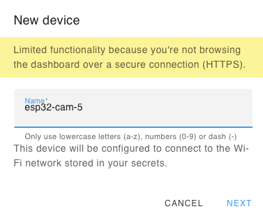
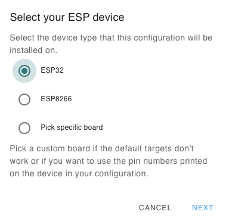

# ESP32-CAM Installation 

{ width="200" }

{ width="100" }

{ width="300" }

{ width="300" }

{ width="200" }

{ width="300" }

Edit the code :
```
esphome:
  name: esp32-cam-5

esp32:
  board: esp32dev
  framework:
    type: arduino

# Enable logging
logger:

# Enable Home Assistant API
api:

ota:
  password: "7178cc19180874c5bd1aaf8cac96abbd"

wifi:
  ssid: !secret wifi_ssid
  password: !secret wifi_password

  # Enable fallback hotspot (captive portal) in case wifi connection fails
  ap:
    ssid: "Esp32-Cam-5 Fallback Hotspot"
    password: "nm87iYcQoqcp"

captive_portal:
# Configuration for Ai-Thinker Camera
# https://esphome.io/components/esp32_camera.html#configuration-for-ai-thinker-camera
esp32_camera:
  name: "ESP32-cam-5"
  external_clock:
    pin: GPIO0
    frequency: 20MHz
  i2c_pins:
    sda: GPIO26
    scl: GPIO27
  data_pins: [GPIO5, GPIO18, GPIO19, GPIO21, GPIO36, GPIO39, GPIO34, GPIO35]
  vsync_pin: GPIO25
  href_pin: GPIO23
  pixel_clock_pin: GPIO22
  power_down_pin: GPIO32
  # Image settings
  max_framerate: 10 fps    # default: 10 fps, max 60
  idle_framerate: 0.2 fps # default: 0.1 fps - framerate for 'picture' in HA dashboard
  resolution: 1024x768     # default: 640x480 (VGA) - higher res requires more memory
  jpeg_quality: 10        # 10 (best) to 63 (worst)

switch:
  - platform: gpio
    name: "ESP32-cam-5 flash"
    pin: 4
    #inverted: True
  - platform: restart
    name: "ESP32-cam-5 - Restart"
    id: restart_switch
```
Select **Manual download**

{ width="300" }

{ width="500" }

{ width="500" }

!!! WARNING
    If the ESP is not visible on the serial port, it may be due to the cable, you must try another one

    { width="300" }

!!! WARNING
    If an error appears, it means that the ESP is not in "write" mode. You must then press the "IO0" button THEN connect the ESP and flash it.

    { width="250" }


{ width="500" }

>Disconnect then reconnect the ESP

{ width="300" }

{ width="300" }

{ width="300" }

{ width="300" }

{ width="300" }

{ width="300" }

{ width="300" }

{ width="300" }
