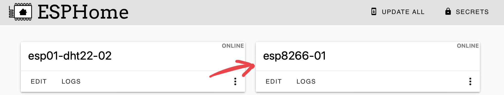
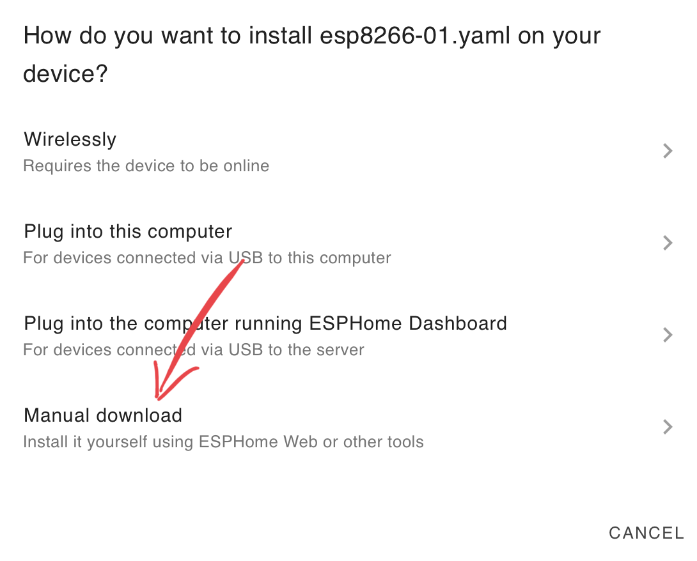
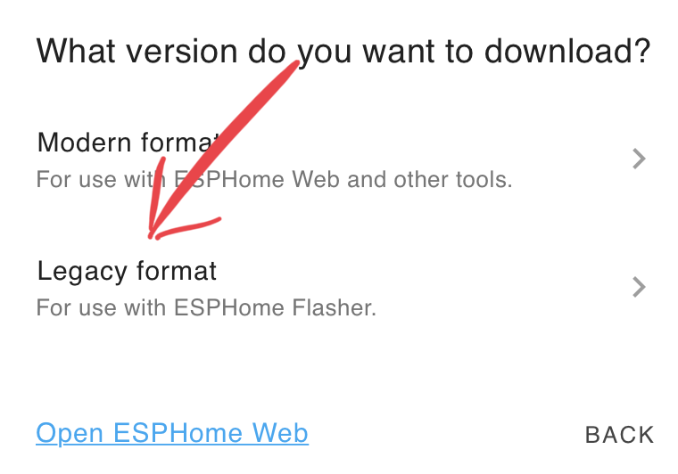
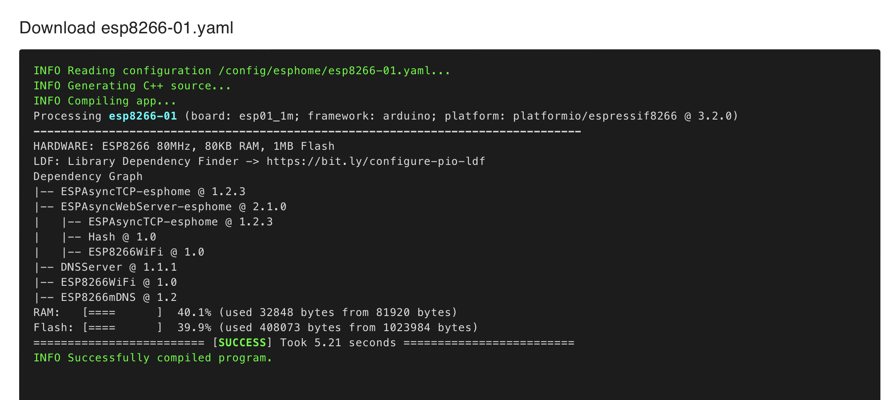
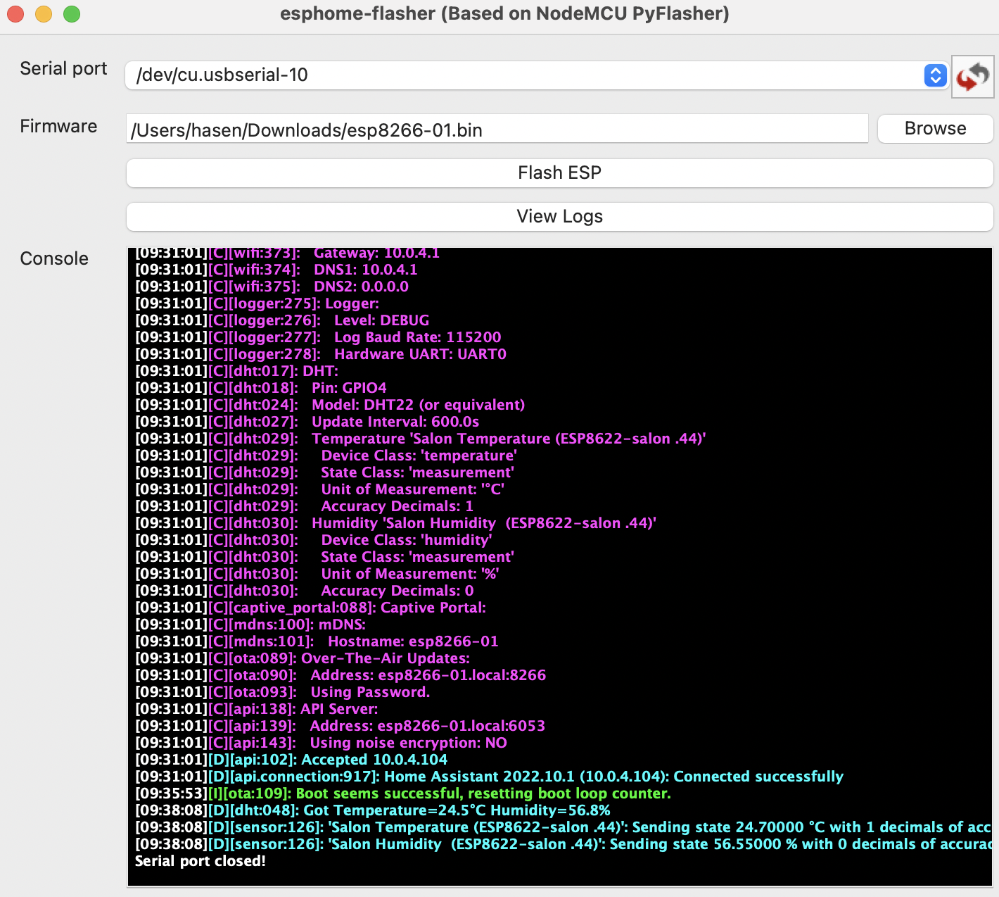
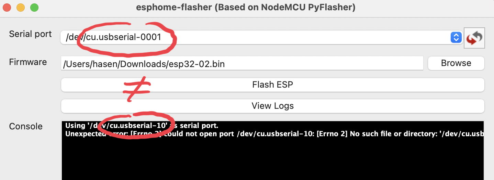
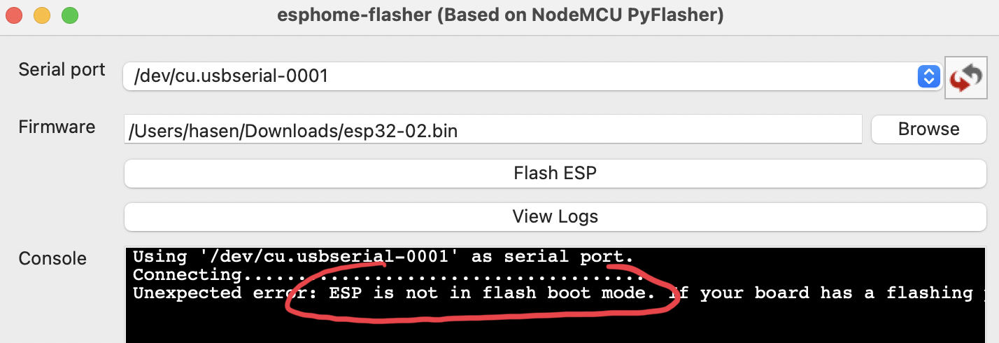
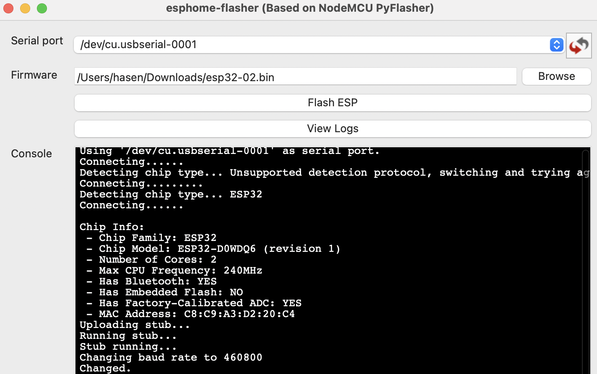

# Flash ESP
## Example of ESP8266 + DHT22



```
esphome:
  name: esp8266-01

esp8266:
  board: esp01_1m

# Enable logging
logger:

# Enable Home Assistant API
api:

ota:
  password: "fce4d1f6a9c5d8fb2a1158b0013b182c"

wifi:
  ssid: !secret wifi_ssid
  password: !secret wifi_password

  # Enable fallback hotspot (captive portal) in case wifi connection fails
  ap:
    ssid: "Esp8266-01 Fallback Hotspot"
    password: "uUcRFwj1RvMz"

captive_portal:
sensor:
  - platform: dht
    model: DHT22
    pin: 4
    temperature:
      name: "Salon Temperature (ESP8622-salon .44)"
      filters:
        offset: 0.2      
    humidity:
      name: "Salon Humidity  (ESP8622-salon .44)"
      filters:
        offset: -0.25      
    update_interval: 600s
```










!!! failure "Could not open serial port"

    

    ESP is not in flash mode -> press boot button when you flash

    

    

