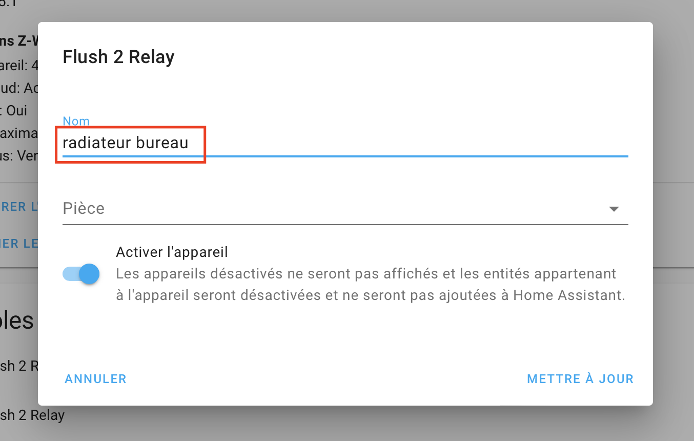

# Relais Qubino Flush 2 sur un radiateur électrique
## Modèle
{ width="200" }

!!! info
    Site de Qubino : [https://qubino.com/products/flush-2-relays/](https://qubino.com/products/flush-2-relays/)

{ width="200" }
{ width="200" }
{ width="200" }
{ width="200" }
{ width="200" }
{ width="200" }
{ width="200" }

## Cablage
Remplacer l'ampoule par le radiateur !!!

{ width="300" }
{ width="300" }

## Config Home Assistant

{ width="450" }

{ width="450" }

{ width="450" }

{ width="350" }

## Renommer le relay
{ width="450" }

{ width="450" }

{ width="450" }

{ width="450" }

{ width="450" }

## Si le relay n'est plus accéssible

!!! note
    Lire la [documentation](Docs/Qubino_Flush-2-Relay-PLUS-extended-manual_eng_2.3.pdf ).

Faire un reset usine :
Débrancher - rebrancher 5 fois en moins de 3 seconde dans la première minute du brachement ! 

!!! info
    FACTORY RESET
        1. Connect the device to the power supply
        2. Within the first minute (60 seconds) the device is connected to the >power supply, toggle the switch connected to the I1 terminal 5 times >within 3 seconds (5 times change switch state).