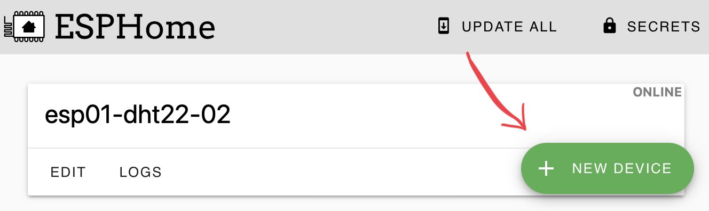
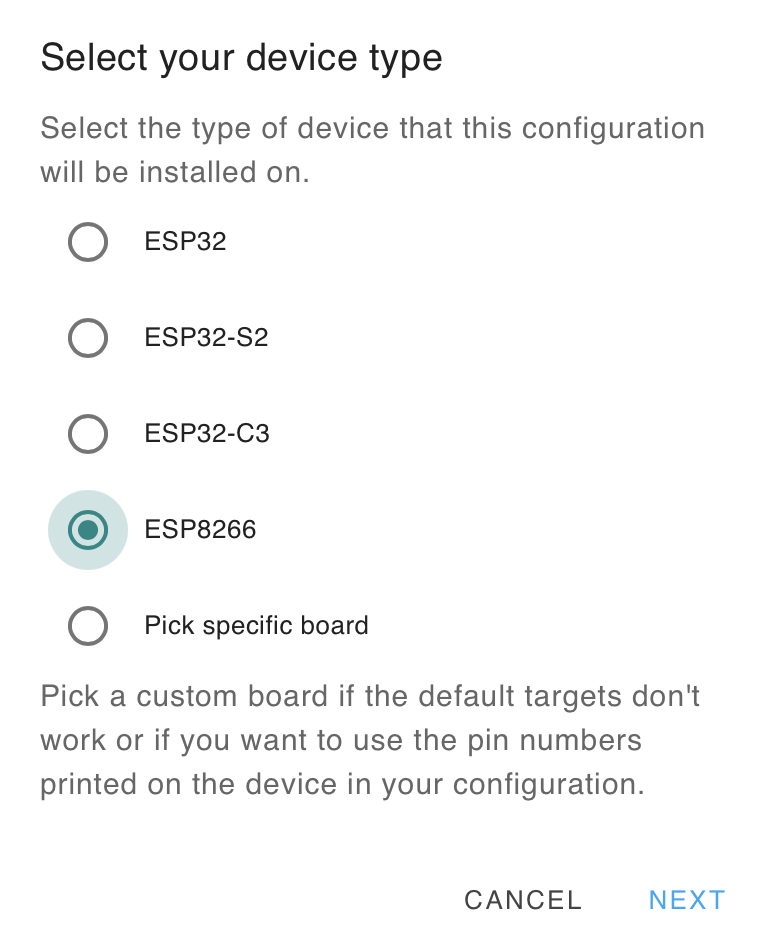
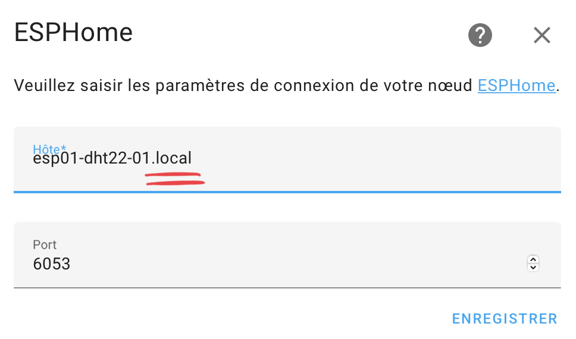

# Integration ESPhome

## Add

{ width="400" }

{ width="400" }

{ width="400" }

{ width="400" }

## Remove

{ width="400" }

{ width="400" }

{ width="400" }

## Re-discover / manually add Integration

!!! note
    You can just add the integration via the Add Integration button, use the device name with "**.local**" at the end for the host name.

{ width="200" }

{ width="400" }

{ width="400" }

{ width="400" }
