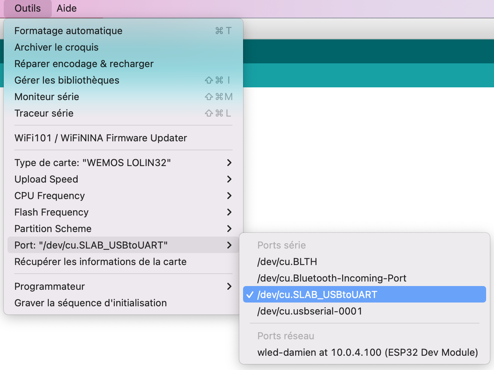
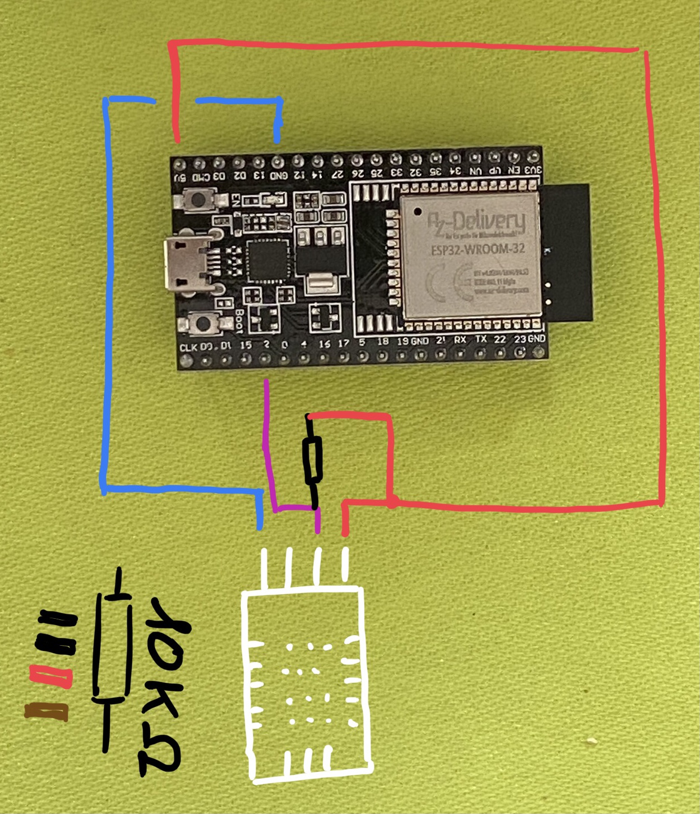
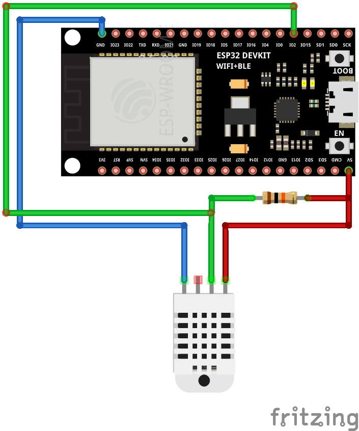
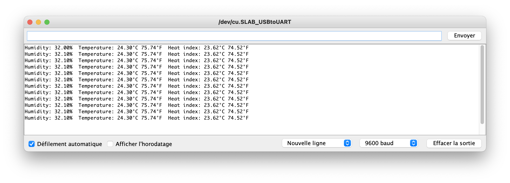
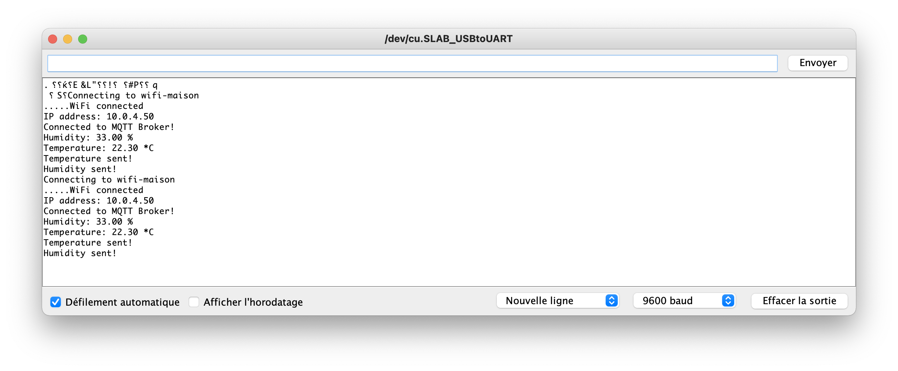
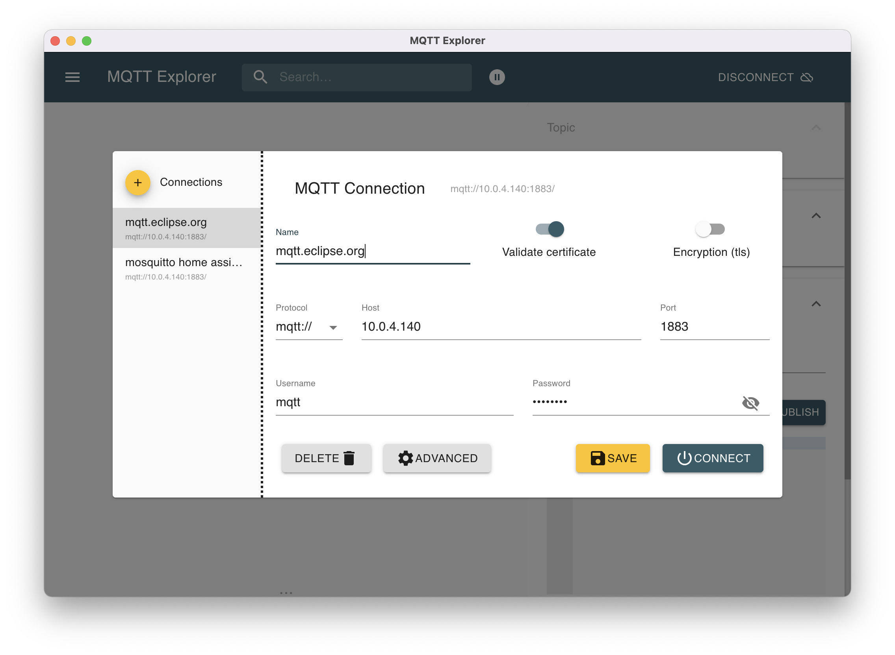
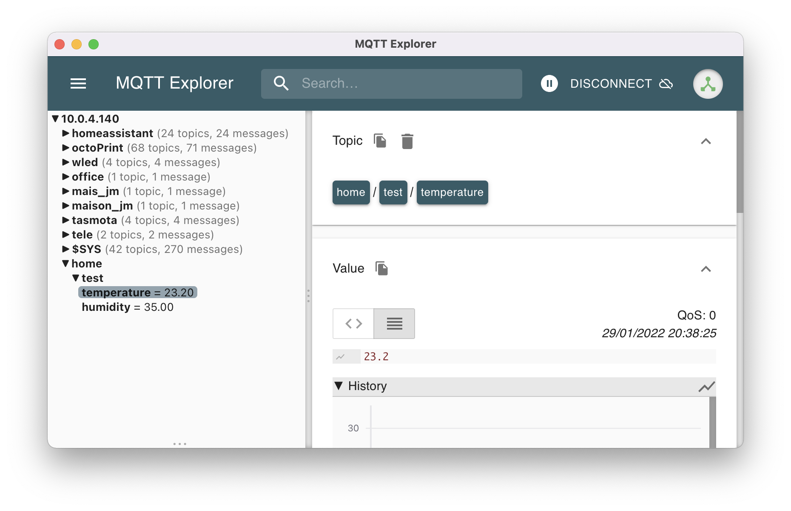
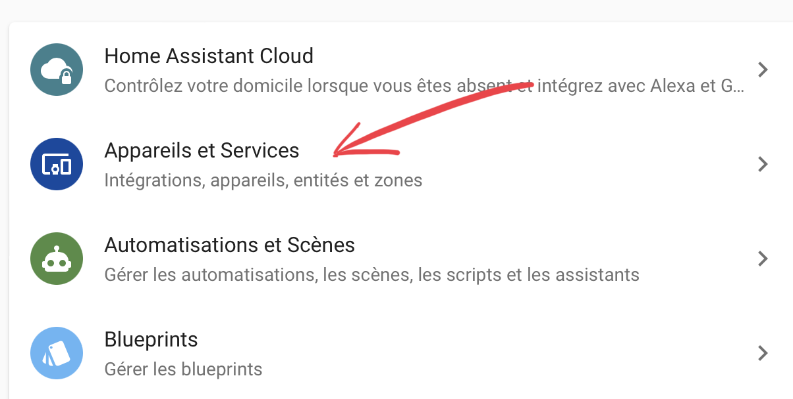
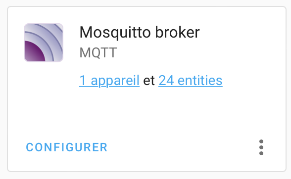
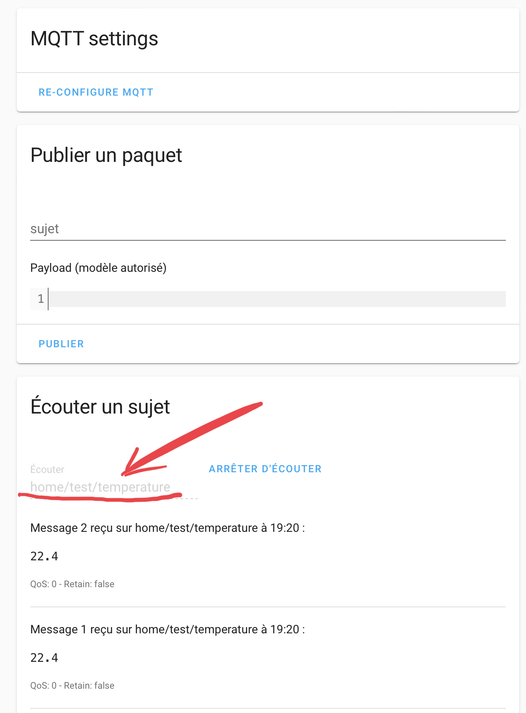

# ESP32 + DHT22

## USB port connection

{ width="400" }

## Wire DHT22

{ width="300" }
{ width="300" }

## Code
### Test code to check pins

Use "DHTtester.ino" example code given with DHT22 lib.

{ width="400" }


### MQTT Code
Voir : [https://diyi0t.com/microcontroller-to-raspberry-pi-wifi-mqtt-communication/](https://diyi0t.com/microcontroller-to-raspberry-pi-wifi-mqtt-communication/)

```
#include "DHT.h"
#include "PubSubClient.h" // Connect and publish to the MQTT broker

// Code for the ESP32
#include "WiFi.h" // Enables the ESP32 to connect to the local network (via WiFi)
#define DHTPIN 2  // Pin connected to the DHT sensor

// Code for the ESP8266
//#include "ESP8266WiFi.h"  // Enables the ESP8266 to connect to the local network (via WiFi)
//#define DHTPIN D5         // Pin connected to the DHT sensor

#define DHTTYPE DHT22  // DHT11 or DHT22
DHT dht(DHTPIN, DHTTYPE);

// WiFi
const char* ssid = "xxxxxxx";                 // Your personal network SSID
const char* wifi_password = "xxxxxx"; // Your personal network password

// MQTT
const char* mqtt_server = "xx.xx.xx.xx";  // IP of the MQTT broker
const char* humidity_topic = "home/test/humidity";
const char* temperature_topic = "home/test/temperature";
const char* mqtt_username = "mqtt"; // MQTT username
const char* mqtt_password = "mqttmqtt"; // MQTT password
const char* clientID = "test-C8:C9:A3:D2:BA:EC"; // MQTT client ID - I but the Mac adresse

// Initialise the WiFi and MQTT Client objects
WiFiClient wifiClient;
// 1883 is the listener port for the Broker
PubSubClient client(mqtt_server, 1883, wifiClient); 


// Custom function to connet to the MQTT broker via WiFi
void connect_MQTT(){
  Serial.print("Connecting to ");
  Serial.println(ssid);

  // Connect to the WiFi
  WiFi.begin(ssid, wifi_password);

  // Wait until the connection has been confirmed before continuing
  while (WiFi.status() != WL_CONNECTED) {
    delay(500);
    Serial.print(".");
  }

  // Debugging - Output the IP Address of the ESP8266
  Serial.println("WiFi connected");
  Serial.print("IP address: ");
  Serial.println(WiFi.localIP());

  // Connect to MQTT Broker
  // client.connect returns a boolean value to let us know if the connection was successful.
  // If the connection is failing, make sure you are using the correct MQTT Username and Password (Setup Earlier in the Instructable)
  if (client.connect(clientID, mqtt_username, mqtt_password)) {
    Serial.println("Connected to MQTT Broker!");
  }
  else {
    Serial.println("Connection to MQTT Broker failed...");
  }
}


void setup() {
  Serial.begin(9600);
  dht.begin();
}

void loop() {
  connect_MQTT();
  Serial.setTimeout(2000);
  
  float h = dht.readHumidity();
  float t = dht.readTemperature();
  
  Serial.print("Humidity: ");
  Serial.print(h);
  Serial.println(" %");
  Serial.print("Temperature: ");
  Serial.print(t);
  Serial.println(" *C");

  // MQTT can only transmit strings
  String hs="Hum: "+String((float)h)+" % ";
  String ts="Temp: "+String((float)t)+" C ";

  // PUBLISH to the MQTT Broker (topic = Temperature, defined at the beginning)
  if (client.publish(temperature_topic, String(t).c_str())) {
    Serial.println("Temperature sent!");
  }
  // Again, client.publish will return a boolean value depending on whether it succeded or not.
  // If the message failed to send, we will try again, as the connection may have broken.
  else {
    Serial.println("Temperature failed to send. Reconnecting to MQTT Broker and trying again");
    client.connect(clientID, mqtt_username, mqtt_password);
    delay(10); // This delay ensures that client.publish doesn't clash with the client.connect call
    client.publish(temperature_topic, String(t).c_str());
  }

  // PUBLISH to the MQTT Broker (topic = Humidity, defined at the beginning)
  if (client.publish(humidity_topic, String(h).c_str())) {
    Serial.println("Humidity sent!");
  }
  // Again, client.publish will return a boolean value depending on whether it succeded or not.
  // If the message failed to send, we will try again, as the connection may have broken.
  else {
    Serial.println("Humidity failed to send. Reconnecting to MQTT Broker and trying again");
    client.connect(clientID, mqtt_username, mqtt_password);
    delay(10); // This delay ensures that client.publish doesn't clash with the client.connect call
    client.publish(humidity_topic, String(h).c_str());
  }
  client.disconnect();  // disconnect from the MQTT broker
  delay(1000*60);       // print new values every 1 Minute
}
```
Here is the output

{ width="650" }

# MQTT Explorer
For testing MQTT, use "MQTT Explorer" (Apple Store)

{ width="650" }

{ width="650" }

# Home Assistant
## Configuration
Copy code into the configuration.yaml file
```
sensor:
  - platform: mqtt  
    unique_id: "C8:C9:A3:D2:BA:EC_temp"
    state_topic: "home/test/temperature"  
    name: "Test-MQTT-Temperature"  
    unit_of_measurement: "°C"
    value_template: "{{  value | round(1) }}"
  - platform: mqtt  
    unique_id: "C8:C9:A3:D2:BA:EC_humi"
    state_topic: "home/test/humidity"  
    name: "Test-MQTT-Humidity"  
    unit_of_measurement: "%"
    value_template: "{{  value | round(0) }}"
```
## Test result
Appareils et services :

{ width="400" }

Mosiquitto

{ width="400" }

MQTT settings

{ width="400" }

## Add to Lovelace
New entities appears into entities list
