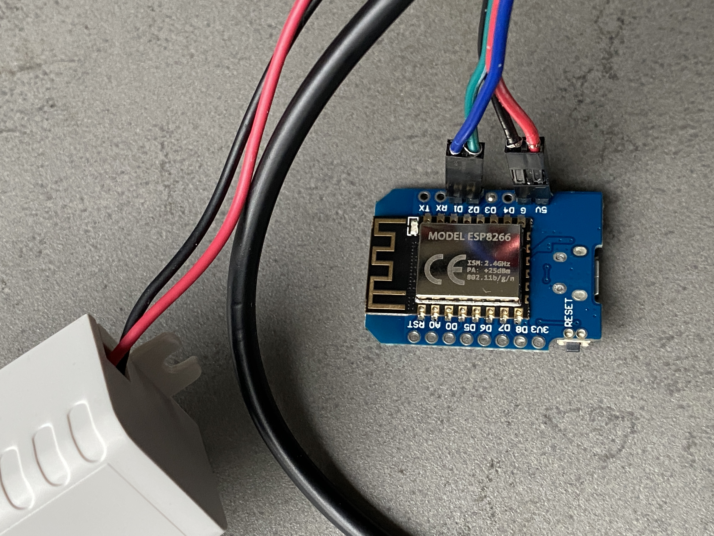

PZEM-004T

{ width="250" }
{ width="250" }
{ width="250" }
{ width="250" }
{ width="250" }
{ width="250" }

{ width="250" }
{ width="250" }
{ width="250" }
{ width="250" }
{ width="250" }
{ width="250" }

```
esphome:
    name: "energy-meter"
    comment: 'PZEM-004T power Meter'

esp8266:
    board: d1_mini

# Enable logging
logger:
    #level: VERY_VERBOSE

web_server:
    port: 80

api:

ota:

wifi:
    ssid: !secret wifi_ssid
    password: !secret wifi_password

# Enable fallback hotspot (captive portal) in case wifi connection fails
ap:
    ssid: "Power-Meter Fallback Hotspot"
    password: "rdG3mcBzeb32"

uart:
    rx_pin: D1
    tx_pin: D2
    baud_rate: 9600

captive_portal:

modbus:  # enable Modbus

sensor:
    - platform: pzemac
        current:
            name: 'Current'
        voltage:
            name: 'Voltage'
    energy:
        name: 'Energy'
        # convert it to kWh
        #filters:
        #  - multiply: 0.001
        #unit_of_measurement: 'kWh'
        #accuracy_decimals: 3
    power:
        name: 'Power'
    frequency:
        name: 'Frequency'
    power_factor:
        name: 'Power Factor'
    update_interval: 60s
```


{ width="250" }
{ width="250" }
{ width="250" }
{ width="250" }
{ width="250" }
{ width="250" }
{ width="250" }
