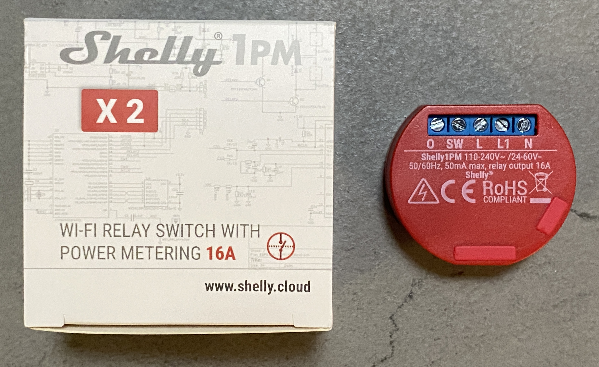
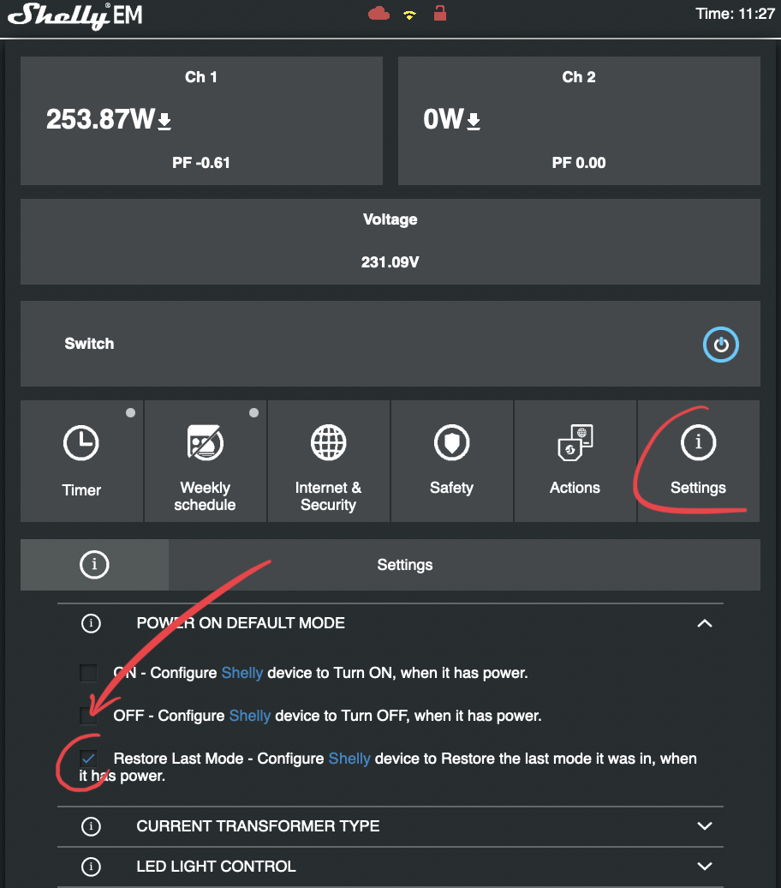

# Shelly 1 with MQTT

**How to use Shelly 1 & Shelly 1PM with Home Assistant**
!!! info
    An other interested page is https://sequr.be/blog/2020/10/getting-started-with-mqtt-and-home-assistant-and-shelly/

### Shelly 1 & Shelly 1PM

{ width="320" }
{ width="290" }

## Wire
### Shelly 1
{ width="300" }
{ width="280" }
!!! danger "Don't link SW to I, this desable the manual switch."

### Shelly 1PM
{ width="300" }

### Cumulus & Shelly 1PM
{ width="280" }
!!! danger "Don't link SW to I, this desable the manual switch."

## Configuration
### Shelly configuration
Plug in the Shelly. It does not appear on the network.
You have to go on the Shelly app first to declare it.
It's not necessary to go to the end of the installation.
We can stop when we ask for the name of the device.

{ width="150" }
{ width="150" }
{ width="150" }
{ width="150" }

You can now find the device on the networker. In my example the IP of the device is 10.0.4.
Go to the web interface of the Shelly and **remove the connection to the cloud**.

{ width="500" }

!!! warning
    **Update** the device. It's necessery to have **CoIot** protocol.
    
    { width="500" }

To configure MQTT protocol, fill in the fields with values defined in Home Assistant.

{ width="400" }

!!! info "Username and password are in the Mosquitto configuration. Password is a very long string"

    { width="200" }
    { width="300" }

    { width="400" }

Set "Restore Last Mode - Configure Shelly device to Restore the last mode it was in, when it has power."

{ width="380" }

Now, you can reboot the Shelly.

{ width="400" }

### Home Assistant configuration

The configuration of the Shelly device is now finished. Go to Home Assistant for the last step.

{ width="200" }
{ width="400" }

{ width="300" }
{ width="300" }

