# Tasmota - Athom Plug V2

## Configuration of Tasmota plug
Open Tasmota plug web page (here 10.0.4.97)

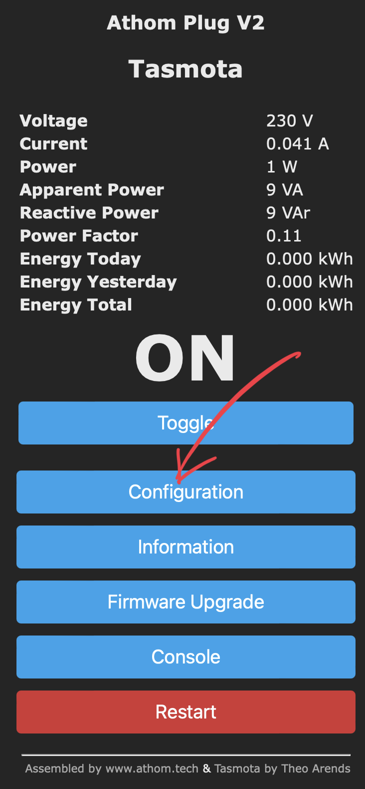{ width="200" }
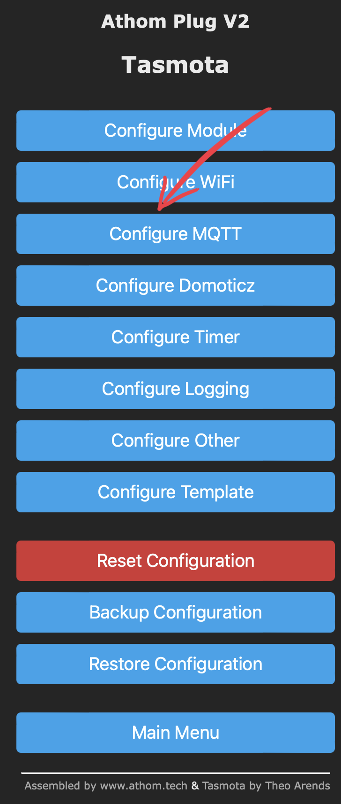{ width="200" }
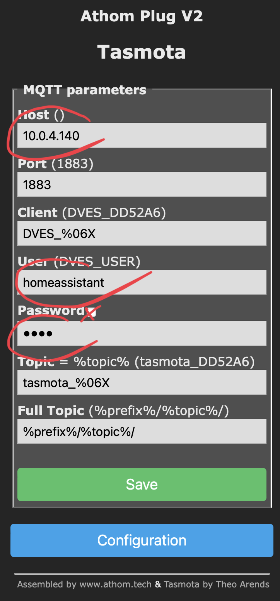{ width="200" }

!!! warning  "Find passord"
    Go to MQTT configaration panel to find home assiatnt password.

    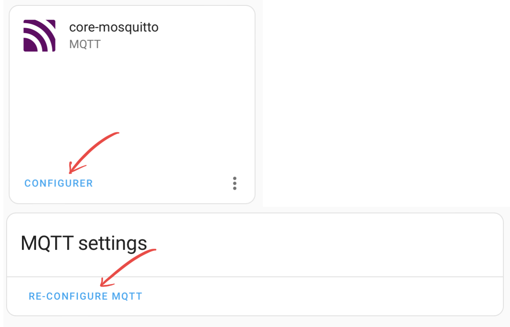{ width="305" }
    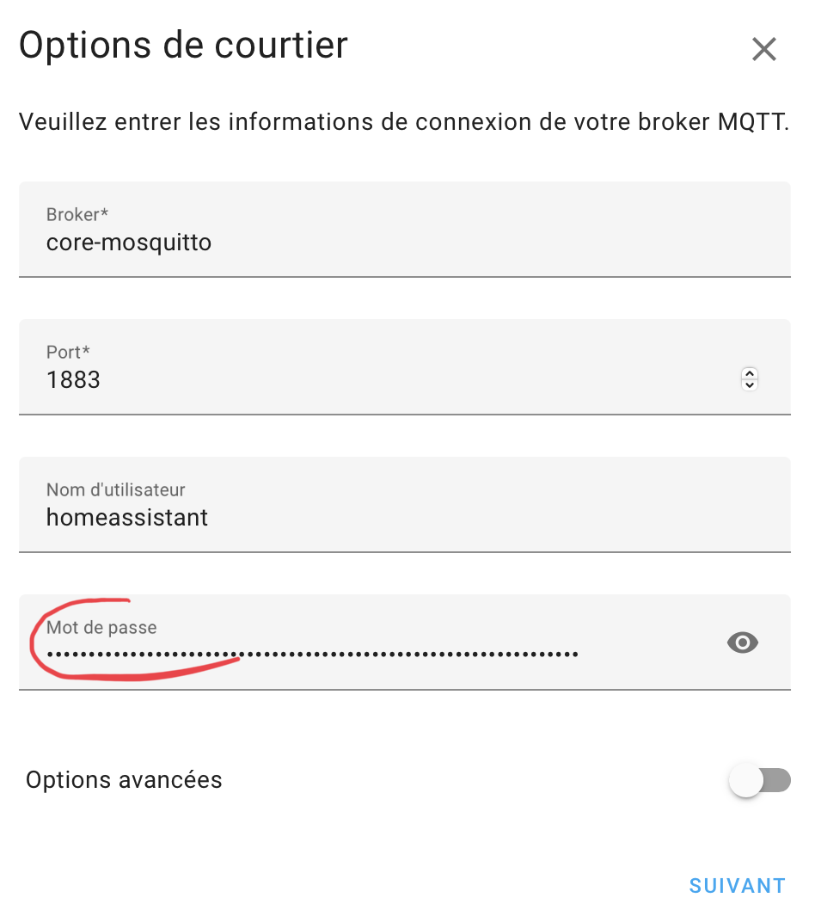{ width="250" }

Copy/passed password into Tasmota plug page.

Wait a few seconds. The new Tasmota plug is automaticaly discored.

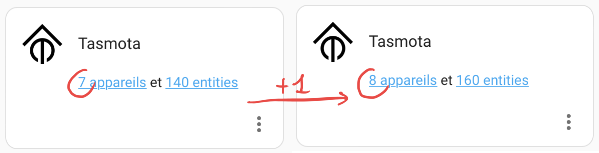{ width="600" }

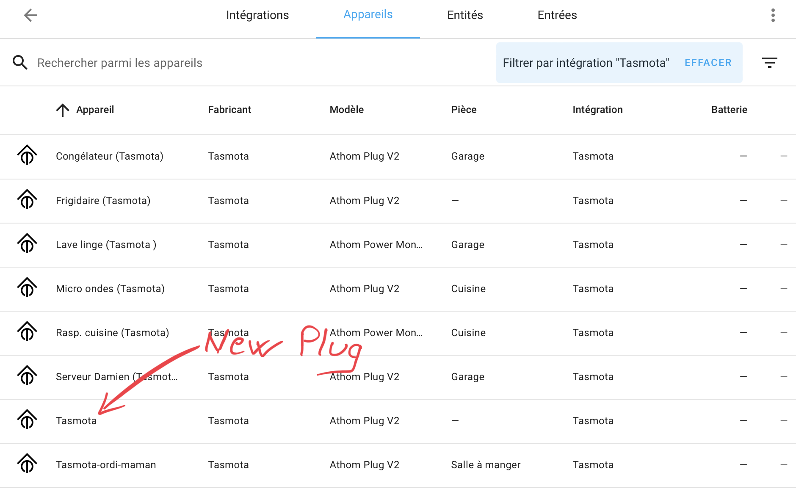{ width="600" }

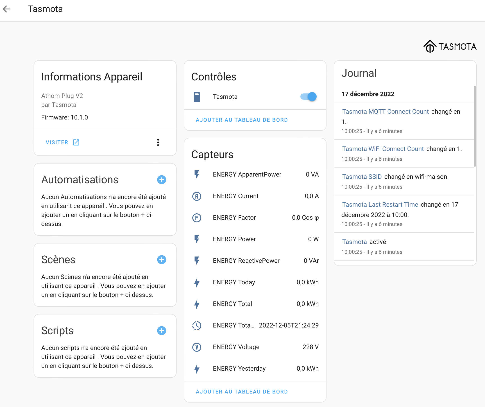{ width="600" }

## To reset total energey

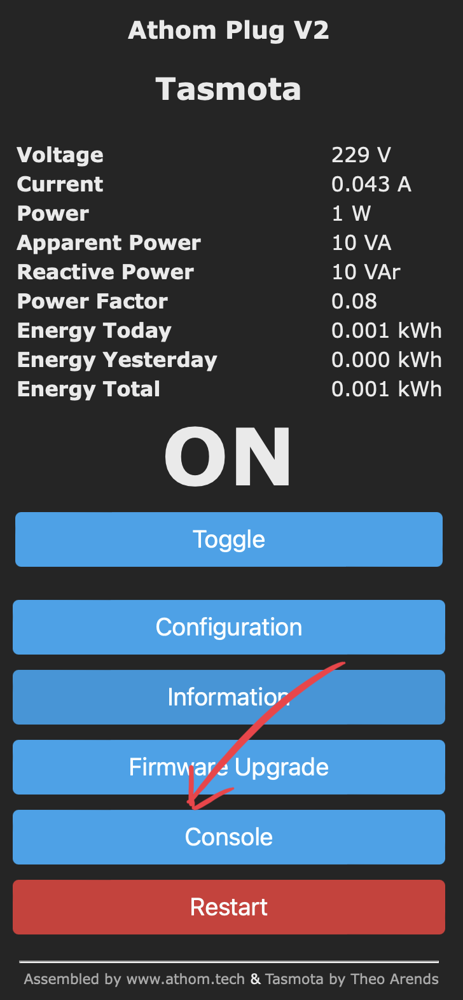{ width="300" }
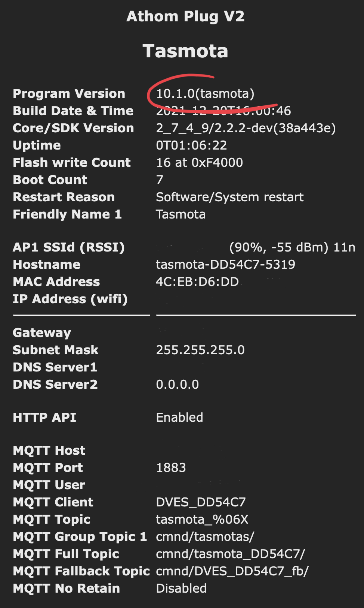{ width="300" }
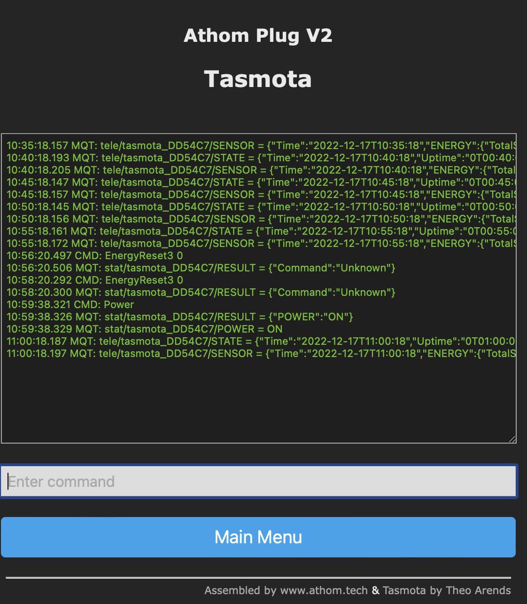{ width="600" }

```
EnergyReset3 0
```
!!! warning
    Warning: With version 10, this command has been replaced
    See: https://tasmota.github.io/docs/Commands/#power-monitoring